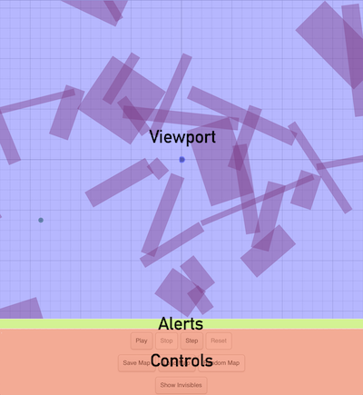
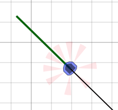
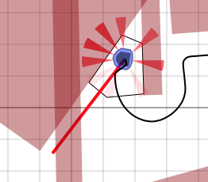
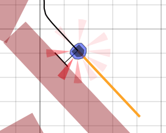
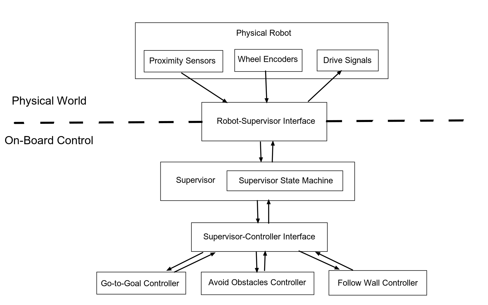

# Sobot Rimulator

A robot programming tool.


Sobot Rimulator is inspired by [Sim.I.Am](http://jpdelacroix.com/software/simiam.html), by [JP de la Croix](http://jpdelacroix.com/). The software simulates a [Khepera III](https://ftp.k-team.com/KheperaIII/UserManual/Kh3.Robot.UserManual.pdf) robot navigating to a goal in an environment of obstacles. The control system packaged with this software is based on the principles of [hybrid automata](https://en.wikipedia.org/wiki/Hybrid_automaton), as taught by [Magnus Egerstedt](https://magnus.ece.gatech.edu/). An in-depth discussion of these principles is given in [this article](https://www.toptal.com/robotics/programming-a-robot-an-introductory-tutorial) on the Toptal Engineering Blog.

## Table of Contents

- [Getting Started](#getting-started)
- [User Interface](#user-interface)
- [Robot Control System Overview](#robot-control-system-overview)

## Getting Started

### Requirements

Sobot Rimulator requires Python 3. Its main dependencies are [Gtk 3](https://www.gtk.org/) and [PyGObject 3](https://pygobject.readthedocs.io/en/latest/index.html), which are used for the UI.

If you are using `pip` you will need to add Gtk3 to your environment separately since it is not a Python library. If you are using `conda` you can create a new environment with everything you need like this:

```
conda create -n sobot-rimulator -c conda-forge python=3 gtk3 pygobject
```

Then to switch to the new environment:

```
conda activate sobot-rimulator
```

### Running the Simulator

From the command line, navigate to the project's root directory. Then type:

```
python simulator.py
```

## User Interface

The simulator interface contains the following elements:

- [Simulation Viewport](#simulation-viewport)
- [Alert Text Panel](#alert-text-panel)
- [Control Panel](#control-panel)



### Simulation Viewport

When the program starts, a randomized map is loaded.

A small blue and black circular object in the center of the viewport is the robot. The dimensions and capabilities of this robot are modeled after the [Khepera III](https://ftp.k-team.com/KheperaIII/UserManual/Kh3.Robot.UserManual.pdf) research robot. The Khepera III is a differential-drive mobile robot. It is equipped with 9 infrared proximity sensors forming a "skirt," with which it can detect nearby obstacles.

A green circle indicates the location of the goal the robot will attempt to reach.

Red rectangles scattered throughout the map are obstacles - if the robot makes contact with an obstacle, a collision will occur and the simulation will end.

A grid is drawn onto the map to help you judge distances. Major gridlines are laid out every meter. Minor gridlines are laid out every 20 centimeters.

### Alert Text Panel

When events such as a collision or successful arrival at the goal occur, it will be reported in the space between the simulation view port and the control panel. When the simulation begins, the alert text panel is blank.

### Control Panel

The control panel is divided into three rows.

The first row of buttons controls the simulation progress:

- **"Play"** - Causes the simulation to proceed until you stop it, or the robot reaches the goal or collides with an obstacle.

- **"Stop"** - Stops the simulation in its current state.

- **"Step"** - Advances the simulation by one simulation cycle. The simulation will be stopped after this button is pressed.

- **"Reset"** - Clears all progress of the robot and resets the simulation.

The second row of buttons gives you control over the map:

- **"Save Map"** - Opens a save dialog. The default location to save maps is in the `/maps` folder of the simulator directory. Saving a map will NOT save the current state of the simulation. It only saves the location of the obstacles and the goal.

- **"Load Map"** - Opens a load dialog. From here you can load previously saved maps.

- **"Random Map"** - Generates a random map on the fly. The simulation resets when a new random map is generated.

The third row of buttons provides a more detailed visualization of what the robot is doing:

- **"Show Invisibles"** - Causes extra information to be drawn to the simulation view that would not be visible in the real world. This includes the robot's traverse path (where it has been so far), the robot's infrared sensor cones, the robot's current desired heading, and other information specific to the current control mode of the robot:

  - A green heading bar indicates that the robot is currently in **Go to Goal** mode.

    

  - A red heading bar indicates that the robot is currently in **Avoid Obstacles** mode. This will be accompanied by a black outline indicating the robot's detected surroundings.

    

  - An orange heading bar indicates that the robot is currently in **Follow Wall** mode. This will be accompanied by two black lines - one indicating the followed surface calculated by the robot, and another indicating the stand-off distance to that obstacle surface.

    

## Robot Control System Overview

Following is a brief overview of the robot control implementation that comes with this software. You are encouraged to play with this code and experiment with different implementations.

The simulated robot's "on-board" control code is found in the `robot_control/` folder.

The below diagram gives a high-level conceptual overview of the relationship between different components at runtime. Arrows represent the direction that information flows. In general, downward arrows carry information about the robot's current state, while upward arrows carry information about the robot's desired next state.



### Robot-Supervisor Interface

The robot is controlled by a supervisor. Instead of talking directly to the simulated "physical" robot, a supervisor is given a `RobotSupervisorInterface` (`robot_supervisor_interface.py`) that defines the entirety of available commands the supervisor can send the robot. The `RobotSupervisorInterface` can be thought of as an API to the robot, providing these instructions:

  - `read_proximity_sensors()`
  - `read_wheel_encoders()`
  - `set_wheel_drive_rates(velocity_left, velocity_right)`

### Supervisor

The `Supervisor` (`supervisor.py`) is the brains of the robot. It contains a `RobotSupervisorInterface`, a `SupervisorStateMachine` that manages control state transitions, and several different controllers that can generate control parameters by various criteria. It also contains odometry code for maintaining an estimate of the robot's current position and heading. The `Supervisor` control-loop sequence is as follows:

  1. **Update State** - update sensor readings, odometry, and controller headings; update the `SupervisorStateMachine` based on the new readings; set new active controller based on the new control state

  1. **Execute Controller** - generate new control parameters using the active controller and the current sensor readings

  1. **Send Commands** - apply the new control parameters to the robot by sending the appropriate robot commands

### Supervisor State Machine

The `SupervisorStateMachine` (`supervisor_state_machine.py`) manages the robot's control state. The version distributed with Sobot Rimulator supports the following control states (defined in `control_state.py`):

  - `ControlState.AT_GOAL`
  - `ControlState.GO_TO_GOAL`
  - `ControlState.AVOID_OBSTACLES`
  - `ControlState.GTG_AND_AO`
  - `ControlState.SLIDE_LEFT`
  - `ControlState.SLIDE_RIGHT`

Once per control loop iteration, the `SupervisorStateMachine` updates itself. It first checks if certain conditions are met (e.g., sensors indicate that an obstacle is very close). Depending on the set of conditions that are met, the state machine may then transition the control state to a new state. A state transition will usually include changing the active controller used by the `Supervisor`.

### Supervisor-Controller Interface

The `SupervisorControllerInterface` (`supervisor_controller_interface.py`) serves as a thin wrapper around the `Supervisor` to simplify communication between it and its various controllers.

### Controllers

This software comes with five controllers that are available to the `Supervisor`:

- `GoToGoalController` (`go_to_goal_controller.py`)
- `AvoidObstaclesController` (`avoid_obstacles_controller.py`)
- `FollowWallController` (`follow_wall_controller.py`)
- `GoToAngleController` (`go_to_angle_controller.py`)
- `GTGAndAOController` (`gtg_and_ao_controller.py`)

Note that `GoToAngleController` and `GTGAndAOController` are not currently being used in this build, but you may enable them if you'd like to see how they behave. Additional controllers can be added fairly easily.

Before the `SupervisorStateMachine` updates, each controller generates a heading vector. Each heading will likely be different, representing the direction the robot should go to perform the behavior that particular controller is designed to implement. These headings are then compared to each other by the `SupervisorStateMachine` as part of its test for state transitions.

After the `SupervisorStateMachine` has updated the control state, the controller that it chose to activate is executed. The active controller generates movement parameters intended to effectively move the robot towards that controller's heading vector. These parameters are given using the "unicycle model" of movement (i.e. a translational velocity parameter (v) and an angular velocity parameter (omega)). The controller updates the `Supervisor` with these new parameters.

Once the final movement parameters have been calculated and applied, the `Supervisor` will transform them from the "unicycle" model into the corresponding wheel movement rates of a "differential drive" model, and command the robot to drive the wheels using these rates.
